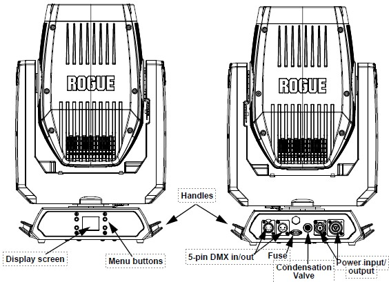
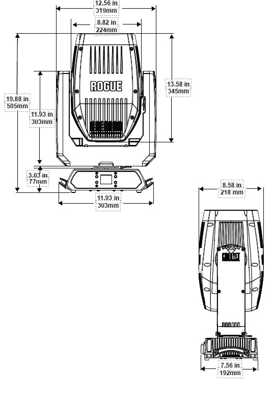
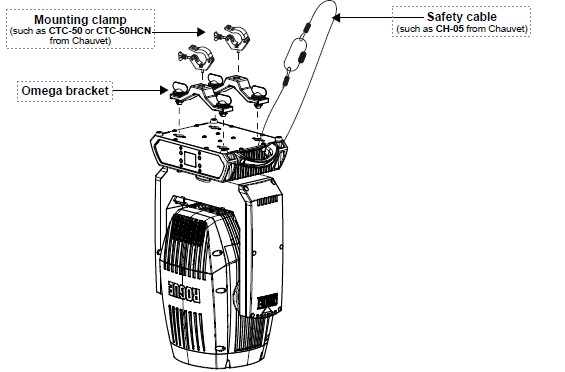

# Rogue Outcast 1L Beam User Manual

## Before You Begin
### What Is Included
- Rogue Outcast 1L Beam
- Seetronic Powerkon IP65 power cable
- 2 Omega brackets with mounting hardware
- Quick Reference Guide

### Claims
Carefully unpack the product immediately and check the container to make sure all the parts are in the package and
are in good condition. If the box or the contents (the product and included accessories) appear damaged from
shipping, or show signs of mishandling, notify the carrier immediately, not Chauvet. Failure to report damage to
the carrier immediately may invalidate a claim. In addition, keep the box and contents for inspection.
For other issues, such as missing components or parts, damage not related to shipping, or concealed damage,
file a claim with Chauvet within 7 days of delivery.

### Safety Notes
Read all the following safety notes before working with this product. These notes contain important information
about the installation, usage, and maintenance of this product.

!!! warning
    This product contains no user-serviceable parts. Any reference to servicing in this User Manual will only apply
    to properly trained, certified technicians. Do not open the housing or attempt any repairs.
!!! info
    All applicable local codes and regulations apply to proper installation of this product.

- The luminaire is intended for professional use only.
- If the external flexible cable or cord of this luminaire is damaged, it shall be replaced by a special cord or cord exclusively available from the manufacturer or its service agent.
- The light source contained in this luminaire shall only be replaced by the manufacturer or its service agent or a similar qualified person.
- #### CAUTION:
    * This product’s housing may be hot when operating. Mount this product in a location with adequate ventilation, at least 20 in (50 cm) from adjacent surfaces.
    * When transferring the product from extreme temperature environments, (e.g., cold truck to warm humid ballroom) condensation may form on the internal electronics of the product. To avoid causing a failure, allow the product to fully acclimate to the surrounding environment before connecting it to power.
    * Flashing light is known to trigger epileptic seizures. User must comply with local laws regarding notification of strobe use.
- #### ALWAYS:
    * Disconnect from power before cleaning the product or replacing the fuse.
    * When using an IP65-rated product in an outdoor environment, use IP65- (or higher) rated power and data cable.
    * Replace and secure IP-rated protective covers to all power, data, USB, or other ports when not in use.
    * Replace the fuse with the same type and rating.
    * Use a safety cable when mounting this product overhead.
    * Connect this product to a grounded and protected circuit.
- #### DO NOT:
    * Open this product. It contains no user-serviceable parts.
    * Look at the light source when the product is on.
    * Leave any flammable material within 20 cm of this product while operating or connected to power.
    * Connect this product to a dimmer or rheostat.
    * Operate this product if the housing, lenses, or cables appear damaged.
    * Submerge this product (adhere to standards for the published IP rating). Regular outdoor operation is fine.
    * Permanently install outdoors in locations with extreme environmental conditions. This includes, but is not limited to:
        * Exposure to a marine/saline environment (within 3 miles of a saltwater body of water).
        * Locations where normal temperatures exceed the temperature ranges in this manual.
        * Locations that are prone to flooding or being buried in snow.
        * Other areas where the product will be subject to extreme radiation or caustic substances.
- ONLY use the handles or the hanging/mounting brackets to carry this product.
- The maximum ambient temperature is 113 °F (45 °C). Do not operate this product at higher temperatures.
- To eliminate unnecessary wear and improve its lifespan, during periods of non-use completely disconnect the product from power via breaker or by unplugging it.
- In the event of a serious operating problem, stop using immediatel

!!! tip
    If a Chauvet product requires service, contact Chauvet Technical Support.

### Expected LED Lifespan
Over time, use and heat will gradually reduce LED brightness. Clustered LEDs produce more heat than single LEDs,
contributing to shorter lifespans if always used at full intensity. The average LED lifespan is 40,000 to 50,000
hours. To extend LED lifespan, maintain proper ventilation around the product, and limit the overall intensity..

## Introduction

### Description
The Rogue Outcast 1L Beam is an IP65 moving head that outputs an intensely bright 140 W beam with 14-position,
individually controllable color wheel for solid and split hues. The outdoor-ready unit raises the bar in
dynamic effect options with its ability to focus down to a pencil-thin 1.4° beam for tight
aerials, overlapping 8- and 5-facet prisms, frost for even light distribution, and 14 rotating
and static gobos for even more creative options. Control is over DMX and RDM.

### Features
- Fully featured, high powered, IP65-rated LED beam fixture with a single color wheel, single gobo wheel,
  rotating and static gobos, and layerable prisms in a lightweight and durable aluminum /magnesium casing.
- Fast and precise movement of pan and tilt functions.
- Individually controllable and layerable 5- and 8-facet prisms.
- Frost for even light distribution.
- 5-pin DMX input/output connections.
- Tight 1.4° beam for extremely focused areal effects.
- RDM enabled for remote addressing and troubleshooting.
- 7 rotating and 7 static gobos on one wheel for dynamic gobo effects.
- Easy to read OLED display with simple, effective menu options.
- Simple and complex DMX channel profiles for programming versatility.
- USB-C port for uploading software.

## Product Overview



## Product Dimensions



## Setup
### AC Power
The Rogue Outcast 1L Beam has an auto-ranging power supply, and it can work with an input voltage range of 100
to 240 VAC, 50/60 Hz. To determine the product’s power requirements (circuit breaker, power outlet, and wiring),
use the current value listed on the label affixed to the product’s back panel, or refer to the product’s
specifications chart. The listed current rating indicates the product’s average current draw under normal conditions.

!!! warning
    - Always connect the product to a protected circuit (a circuit breaker or fuse). Make sure the product has an
    appropriate electrical ground to avoid the risk of electrocution or fire.
    - To eliminate unnecessary wear and improve its lifespan, during periods of non-use completely disconnect
      the product from power via breaker or by unplugging it.

!!! info
    Never connect the product to a rheostat (variable resistor) or dimmer circuit,
    even if the rheostat or dimmer channel serves only as a 0 to 100% switch.

### AC Plug
The Rogue Outcast 1L Beam comes with a power input cord terminated with a Seetronic Powerkon IP65 connector on one
end and an Edison plug on the other end (U.S. market). If the power input cord that came with the product has no plug,
or if the plug needs to be changed, use the table below to wire the new plug.

| Connection | Wire (U.S.) | Wire (Europe)   | Screw Color      |
|------------|-------------|-----------------|------------------|
| AC Live    | Black       | Brown           | Yellow or Brass  |
| AC Neutral | White       | Blue            | Silver           |
| AC Ground  | Green/Yellow | Green/Yellow   | Green            |

### Fuse Replacement
1.	Disconnect this product from the power outlet.
2.	Using a flat-head screwdriver, unscrew the fuse holder cap from the housing.
3.	Remove the blown fuse and replace with another fuse of the same type and rating (T 5 A, 250 V).
4.	Screw the fuse holder cap back in place and reconnect power.

!!! warning
    Make sure to disconnect the product’s power cord before replacing a blown fuse. Always replace the blown
    fuse with another of the same type and rating.

### Power Linking
This product comes with a power input cord. Power-linking cables are available from Chauvet for purchase.It is
possible to power link Rogue Outcast 1L Beam products. See the table below for the current draw at each
voltage and frequency:

|              | 100 V, 60 Hz | 120 V, 60 Hz | 208 V, 60 Hz | 230 V, 50 Hz |240 V, 50 Hz |
|--------------|--------------|--------------|--------------|--------------|-------------|
| Current Draw | 2.45 A       | 2.08 A       | 1.15 A       | 1.04 A       | 1.01 A      |

Never exceed 12 A on a single circuit. Power-linking cables can be purchased separately

### DMX Linking
The Rogue Outcast 1L Beam can be linked to a DMX controller using a 5-pin DMX connection. If using other
DMX-compatible products with this product, each can be controlled individually with a single DMX controller.


### DMX Personalities
The Rogue Outcast 1L Beam uses a 5-pin DMX data connection for the 17- and 19-channel DMX personalities.

- Refer to the Introduction for a brief description of each DMX personality.
- Refer to the Operation chapter to learn how to configure the Rogue Outcast 1L Beam to work in these personalities.
- The DMX Values section provides detailed information regarding the DMX personalities.

### Remote Device Management
Remote Device Management, or RDM, is a standard for allowing DMX-enabled devices to communicate
bi-directionally along existing DMX cabling. Check the DMX controller’s User Manual or with the manufacturer,
as not all DMX controllers have this capability. The Rogue Outcast 1L Beam supports RDM protocol that allows
feedback to make changes to menu map options.

### USB Software Update
The Rogue Outcast 1L Beam allows for software updates with a USB device using the built-in USB port.
To update the software using a USB flash drive, do the following:

#### USB Software Update Part 1:
1. Power on the product, and plug the flash drive into the USB port.
2. Once the flash drive has been detected, the message "USB UPDATE" will be displayed. Press YES.
3. The next screen will show the software versions available for this fixture on the USB drive.
   If the user has multiple versions of software for the same fixture, arrow down to the version
   the user wants to load. Press ENTER.
4. The "USB UPDATE" screen will re-appear. Press YES.
5. The upgrade will start. DO NOT turn off the power or disconnect the USB while the USB LED
   is still blinking during the process. The screen display will read: "USB UPDATE WAIT".
   USB update can take several minutes to complete.

!!! warning
    When the USB stops blinking, all the motors will power down and the display will go blank.
    DO NOT turn off the power. The fixture will automatically reboot when the update is done

#### USB Software Update Part 2:
6. Go to Sys Info on the product's menu map and confirm the firmware revision.
7. When the boot-up process is finished, restart the product.

!!! tip
    - Place the .chl file in the root directory of the USB drive.
    - The product's USB port supports up to 32GB capacity and only works with FAT32 file format.

!!! warning
    Turning off the power or removing the USB while still blinking during the update will cause
    partial or total firmware failure in the targeted fixture(s). If this occurs, the user will
    need the UPLOAD 08 device to fix this. Please contact Chauvet regarding this device.

### Mounting
Before mounting the product, read and follow the safety recommendations indicated in the Safety Notes.

#### Orientation
Always mount this product in a safe position, making sure there is adequate room for ventilation,
configuration, and maintenance.

#### Rigging
Chauvet recommends using the following general guidelines when mounting this product.

- Before deciding on a location for the product, make sure there is easy access to the product for maintenance and
  programming purposes.
- Make sure that the structure onto which the product is being mounted can support the product’s weight
  (see Technical Specifications for weight information).
- When mounting the product overhead, always use a safety cable. Mount the product securely to a rigging point,
  whether an elevated platform or a truss.
- When rigging the product onto a truss, use a mounting clamp of appropriate weight capacity.
- When power linking multiple products, mount the products close enough for power linking cables to reach.
- The bracket adjustment knobs allow for directional adjustment when aiming the product to the desired angle.
  Only loosen or tighten the bracket knobs manually. Using tools could damage the knobs.

#### Procedure
The Rogue Outcast 1L Beam comes with 2 Omega brackets. The user can directly attach mounting clamps
(sold separately) to these omega brackets. Make sure the clamps are capable of supporting the weight of
this product. Use at least one mounting point per product. For the Chauvet Professional line of mounting
clamps, go to [http://www.trusst.com/products](http://www.trusst.com/products).

#### Mounting Diagram


## Operation
### Control Panel Operation
| Button    | Function                                                                                   |
|-----------|--------------------------------------------------------------------------------------------|
| `<MENU>`  | Exits from the current menu or function                                                    |
| `<UP>`    | Enables the selected menu or sets the selected value in to the current function            |
| `<DOWN>`  | Navigates upward through the menu list or increases the numeric value when in a function   |
| `<ENTER>` | Navigates downward through the menu list or decreases the numeric value when in a function |

### Programming
Refer to the Menu Map to understand the menu options. The menu map shows the main level and a
variable number of programming levels for each option

- To go to the desired main level, press `<MENU>` repeatedly until the option shows on the display.
  Press `<ENTER>` to select. This will show the first programming level for that option.
- To select an option or value within the current programming level, press `<UP>` or `<DOWN>`
  until the option shows on the display. Press `<ENTER>` to select. This will show the selected
  value or the first option of the next programming level.
- Press `<MENU>` repeatedly to exit to the previous main level.

### Control Panel Lock
This setting enables the user to activate or disable the control panel lock, which keeps unauthorized
users from changing the product’s settings.

1.	Go to the Key Lock main level.
2.	Select ON or OFF.

!!! tip
    The product will prompt for a passcode to access the product’s main programming level when the control panel
    lock is activated. Enter the following passcode: `<UP>`, `<DOWN>`, `<UP>`, `<DOWN>`, `<ENTER>`

| Main Level | Programming Levels |      |                             | Description                |
|------------|--------------------|------|-----------------------------|----------------------------|
| Address    | 001–512            |      |                             | Sets the starting address  |
|            | DMX                | 17CH | Selects the DMX personality |
|            |                    | 19CH |                             |                            |


### Menu Map
???+ success "Main Menu Graph"
    ```mermaid
    graph LR
      A[Main Level] --> B[Address]
      A --> C[Run Mode]
      A --> D[Setup]
      A --> E[Sys Info]
    
      B --> B1[001–512]
    
      C --> C1[DMX]
      C --> C2[Auto]
      C --> C3[Manual Test]
    
      C1 --> C1a[17CH]
      C1 --> C1b[19CH]
    
      C3 --> MT1[Pan] --> MT1v[0-255]
      C3 --> MT2[Pan Fine] --> MT2v[0-255]
      C3 --> MT3[Tilt] --> MT3v[0-255]
      C3 --> MT4[Tilt Fine] --> MT4v[0-255]
      C3 --> MT5[P/T Speed] --> MT5v[0-255]
      C3 --> MT6[Dimmer] --> MT6v[0-255]
      C3 --> MT7[Dimmer Fine] --> MT7v[0-255]
      C3 --> MT8[Shutter] --> MT8v[0-255]
      C3 --> MT9[Color] --> MT9v[0-255]
      C3 --> MT10[Gobo] --> MT10v[0-255]
      C3 --> MT11[Gobo Rotate] --> MT11v[0-255]
      C3 --> MT12[Prism1] --> MT12v[0-255]
      C3 --> MT13[Prism1 Rotate] --> MT13v[0-255]
      C3 --> MT14[Prism2] --> MT14v[0-255]
      C3 --> MT15[Prism2 Rotate] --> MT15v[0-255]
      C3 --> MT16[Frost] --> MT16v[0-255]
      C3 --> MT17[Focus] --> MT17v[0-255]
      C3 --> MT18[Fine Focus] --> MT18v[0-255]
      C3 --> MT19[Special Function] --> MT19v[0-255]
    
      D --> D1[Pan Reverse]
      D1 --> D1a[On]
      D1 --> D1b[Off]
    
      D --> D2[Tilt Reverse]
      D2 --> D2a[On]
      D2 --> D2b[Off]
    
      D --> D3[Screen Reverse]
      D3 --> D3a[YES]
      D3 --> D3b[NO]
      D3 --> D3c[Auto]
    
      D --> D4[Pan Angle]
      D4 --> D4a[540]
      D4 --> D4b[360]
      D4 --> D4c[180]
    
      D --> D5[Tilt Angle]
      D5 --> D5a[270]
      D5 --> D5b[180]
      D5 --> D5c[90]
    
      D --> D6[BL. O. P/T Move]
      D6 --> D6a[Yes]
      D6 --> D6b[No]
    
      D --> D7[BL. O. Color Move]
      D7 --> D7a[Yes]
      D7 --> D7b[No]
    
      D --> D8[BL. O. Gobo Move]
      D8 --> D8a[Yes]
      D8 --> D8b[No]
    
      D --> D9[Backlight Timer]
      D9 --> D9a[30S]
      D9 --> D9b[1M]
      D9 --> D9c[5M]
      D9 --> D9d[ON]
    
      D --> D10[PWM Option]
      D10 --> D10a[600Hz]
      D10 --> D10b[1200Hz]
      D10 --> D10c[2000Hz]
      D10 --> D10d[4000Hz]
      D10 --> D10e[6000Hz]
      D10 --> D10f[15000Hz]
    
      D --> D11[Fan Mode]
      D11 --> D11a[Auto]
      D11 --> D11b[Full]
      D11 --> D11c[ECO]
    
      D --> D12[USB Update]
      D12 --> D12a[YES]
      D12 --> D12b[NO]
    
      D --> D13[Reset Function]
      D13 --> D13a[Pan/Tilt]
      D13a --> D13a1[YES]
      D13a --> D13a2[NO]
    
      D13 --> D13b[Prism]
      D13b --> D13b1[YES]
      D13b --> D13b2[NO]
    
      D13 --> D13c[Color]
      D13c --> D13c1[YES]
      D13c --> D13c2[NO]
    
      D13 --> D13d[Gobo/Gobo Rotate]
      D13d --> D13d1[YES]
      D13d --> D13d2[NO]
    
      D13 --> D13e[Frost/Focus]
      D13e --> D13e1[YES]
      D13e --> D13e2[NO]
    
      D13 --> D13f[All]
      D13f --> D13f1[YES]
      D13f --> D13f2[NO]
    
      D --> D14[Factory Settings]
      D14 --> D14a[YES]
      D14 --> D14b[NO]
    
      E --> E1[Ver:] --> E1a[V_]
      E --> E2[Running Mode:] --> E2a[---]
      E --> E3[DMX Address:] --> E3a[---]
      E --> E4[Temperature:] --> E4a[-- C]
      E --> E5[Fixture Hours] --> E5a[-----]
      E --> E6[LED Hours:] --> E6a[-----]
      E --> E7[UID:] --> E7a[------------]
      E --> E8[Fan 1:] --> E8a[----]
      E --> E9[Fan 2:] --> E9a[----]
      E --> E10[Base Fan 1:] --> E10a[---]
      E --> E11[Base Fan 2:] --> E11a[---]
    
      
    ```


### Menu Map test 2
???+ success "Main Menu"

    ???+ success "Address"
        - 001–512

    ???+ success "Run Mode"
        - Auto
        ??? success "DMX"
            - 17CH  
            - 19CH
        ??? success "Manual Test"
            - Pan (0–255)
            - Pan Fine (0–255)
            - Tilt (0–255)
            - Tilt Fine (0–255)
            - P/T Speed (0–255)
            - Dimmer (0–255)
            - Dimmer Fine (0–255)
            - Shutter (0–255)
            - Color (0–255)
            - Gobo (0–255)
            - Gobo Rotate (0–255)
            - Prism1 / Prism2 / Rotate (0–255)
            - Frost / Focus / Fine Focus (0–255)
            - Special Function (0–255)

    ???+ success "Setup"
        ??? success "Pan Reverse"
            - On / Off
        ??? success "Tilt Reverse"
            - On / Off
        ??? success "Screen Reverse"
            - YES / NO / Auto
        ??? success "Pan Angle"
            - 540 / 360 / 180
        ??? success "Tilt Angle"
            - 270 / 180 / 90
        ??? success "Backlight Options"
            - BL. O. P/T Move: Yes/No  
            - BL. O. Color Move: Yes/No  
            - BL. O. Gobo Move: Yes/No  
            - Backlight Timer: 30S / 1M / 5M / ON
        ??? success "PWM Option"
            - 600Hz / 1200Hz / 2000Hz / 4000Hz / 6000Hz / 15000Hz
        ??? success "Fan Mode"
            - Auto / Full / ECO
        ??? success "USB Update"
            - YES / NO
        ??? success "Reset Function"
            ??? success "Pan/Tilt"
                - YES / NO
            ??? success "Prism"
                - YES / NO
            ??? success "Color"
                - YES / NO
            ??? success "Gobo / Gobo Rotate"
                - YES / NO
            ??? success "Frost / Focus"
                - YES / NO
            ??? success "All"
                - YES / NO
        ??? success "Factory Settings"
            - YES / NO

    ???+ success "Sys Info"
        - Version: `V_`
        - Running Mode: `---`
        - DMX Address: `---`
        - Temperature: `-- C`
        - Fixture Hours: `-----`
        - LED Hours: `-----`
        - UID: `------------`
        - Fan 1/2: `----`
        - Base Fan 1/2: `---`

### Menu Map test 3
???+ success "Main Menu Graph"
    ```mermaid
        graph TD
          Main --> Address
          Main --> RunMode
          Main --> Setup
          Main --> SysInfo
    ```


### Address
This programming level sets the DMX starting address. In this mode, each product will respond to a unique
starting address from the DMX controller. All products with the same starting address will respond in
unison. This option sets the products DMX address.

- Starting from the Main Level screen, select `Address`.
- Press `<ENTER>`.
- Select the starting address `(001–512)`, press `<ENTER>`.

### Run Mode
This programming level sets the DMX personality and controls the different test modes.

- Starting from the Main Level screen, select `Run Mode`, press `<ENTER>`

### DMX Personality 
This setting allows users to choose a particular DMX personality.

1. Highlight DMX, press `<ENTER>`.
2. Select the DMX personality `17CH` or `19CH`, then press `<ENTER>`.

!!! tip
    Make sure that the starting addresses on the various products do not overlap due to
    the new personality setting.

### Auto Test
This option runs every attribute individually through one cycle.

1. Highlight `Auto Test`.
2. Press `<ENTER>`.

!!! tip
    The `Auto Test` will end after one full cycle. Users can stop the test by pressing `<MENU>` at
    any time.

### Manual Test
This option allows each attribute to run individually or as a group.

1. Highlight `Manual Test`, press `<ENTER>`.
2. Highlight the desired attribute listed on the control panel screen, press `<ENTER>`.
3. Set the attribute value `(000–255)`, press `<ENTER>`.
4. Repeat step 2 for the other attributes.

!!! tip
    When exiting the Manual Test level, the values of all tested channels will revert to zero.

### Setup
This programming level controls the product’s head movement, display, dimming, lamp settings, and
maintenance adjustments.

- Starting from the Main Level screen, select Setup, press <ENTER>.

### Pan Reverse
Reverses the operation of the pan attribute.

1. Highlight `Pan Reverse`, press `<ENTER>`.
2. Select `ON` (reverse pan) or `OFF` (normal pan), press `<ENTER>`.

### Tilt Reverse
Reverses the operation of the tilt attribute.

1. Highlight `Tilt Reverse`, press `<ENTER>`.
2. Select `ON` (reverse tilt) or `OFF` (normal tilt), press `<ENTER>`.

### Screen Reverse
To set the orientation of the display:

1. Go to the `Setup` main level.
2. Select the `Screen Rev` option.
3. Select from `NO` (right-side up), `YES`(upside-down) or `AUTO`.

### Pan Angle
This option assigns pan range.

1. Highlight `Pan Angle`, press `<ENTER>`.
2. Select `540`, `360`, or `180`, press `<ENTER>`.

### Tilt Angle
This option assigns tilt range.

1. Highlight `Tilt Angle`, press `<ENTER>`.
2. Select `90`, `180`, or `270`, press `<ENTER>`.

### BL.O. P/T Move
Enables/disables blackout on pan/tilt move.

1. Highlight `BL.O.P/T Move`, press `<ENTER>`.
2. Select `YES` (blackout while panning/tilting) or `NO` (disable blackout while panning/tilting), press
   `<ENTER>`.

### BL.O. Color Move
Enables/disables blackout on color wheel move.

1. Highlight `BL.O.Color Move`, press `<ENTER>`.
2. Select `YES` (blackout while color wheel is moving) or `NO` (disable blackout while color wheel is
   moving), press `<ENTER>`.

### BL.O. Gobo Move
Enables/disables blackout on gobo wheel move.

1. Highlight `BL.O.Gobo Move`, press `<ENTER>`.
2. Select `YES` (blackout while gobo wheel is moving) or `NO` (disable blackout while gobo wheel is
   moving), press `<ENTER>`.

### Backlight Timer
To set the length of time before an inactive display will turn off:

1. Select the `Backlight Timer` option.
2. Select the length of the backlight timer, from `30S` (30 seconds), `1M` (1 minute), `5M` (5 minutes), or
   `ON` (always on).

### Pulse Width Modulation
To adjust the frequency of the pulse width modulation:

1. Select the `PWM` Option option.
2. Select the frequency, from `600Hz`, `1200Hz`, `2000Hz`, `4000Hz`, `6000Hz`, or `15000Hz`.
3. Press `<ENTER>`.

### Fan Mode
To set the fan speed mode:

1. Select the `Fans` option.
2. Select the fan mode, from `Auto` (fan speed adjusts to product temperature), `Full` (fan speed at
   maximum), or `ECO` (quiet mode).

### USB Update
To enable or disable software update using USB:

1. Select the `USB Update` option.
2. Select `NO` (disables software update through USB) or `YES` (enables software update through
   USB).

### Reset Function
This programming level allows the user to reset individual functions to the home position.

1. Starting from the Setup screen level, select `Reset Function`.
2. Press `<ENTER>`.

### Pan/Tilt Reset
This option resets the pan/tilt functions to the home position.

1. Highlight `Pan/Tilt`, press `<ENTER>`.
2. Select `YES` or `NO`, press `<ENTER>`.

### Prism Reset
This option resets the prism functions to the home position.

1. Highlight `Prism`, press `<ENTER>`.
2. Select `YES` or `NO`, press `<ENTER>`.

### Color Reset
This option resets the color functions to the home position.

1. Highlight `Color`, press `<ENTER>`.
2. Select `YES` or `NO`, press `<ENTER>`.

### Gobo/Gobo Rotate Reset
This option resets the gobo functions to the home position.

1. Highlight `Gobo/ Gobo Rotate`, press `<ENTER>`.
2. Select `YES` or `NO`, press `<ENTER>`.

### Frost/Focus Reset
This option resets the frost/focus functions to the home position.

1. Highlight `Frost/Focus`, press `<ENTER>`.
2. Select `YES` or `NO`, press `<ENTER>`.

### All Reset
This option resets the all the functions to the home position.

1. Highlight `All`, press `<ENTER>`.
2. Select `YES` or `NO`, press `<ENTER>`.

### Factory Reset Function
This resets the product back to its original factory settings.

1. Starting from the Setup screen level, select `Factory Settings`, press `<ENTER>`.
2. Select `YES` or `NO`, press `<ENTER>`.

### System Information
This programming level shows standard information regarding the product’s operating status. Starting from
the Main Level screen, select `Sys Info`, press `<ENTER>`.

- `Ver`: The current software version is displayed on the screen.
- `Running Mode`: The current running mode is displayed on the screen.
- `DMX Address`: The current DMX address is displayed on the screen.
- `Temperature`: The current product temperature is displayed on the screen.
- `Fixture Hours`: The product’s total running time is displayed on the screen
- `LED Hours`: The LED’s total running time is displayed on the screen.
- `UID`: The product’s UID is displayed on the screen.
- `Fan 1`/`Fan 2`: The product’s fan speed is displayed on the screen.
- `Base Fan 1`/`Base Fan 2`: The product’s base fan speed is displayed on the screen.

### Offset Mode
The Offset mode provides fine adjustments for the home position of every moving part in the optical path
as well as the pan and tilt movements. To adjust these options and prevent borders showing or reduction of
the light output:

1. From the main level screen, press and hold `<MENU>` until the passcode screen appears.
2. Enter the passcode: 2323 and press `<ENTER>`.
3. Select the “zero” position to adjust, from `PAN`, `TILT`, `COLOR`, `GOBO`, `GOBO ROTATE`, `PRISM1`, `PRISM2`, 
`ROTATE2`,`FROST`, `FOCUS`, `DIMMER`, `RDM4`, `RDM5`, `RDM6`.
4. Adjust the “zero” position for the selected function from `000–255`.

## Maintenance
### Product Maintenance
Dust build-up reduces light output performance and can cause overheating. This can lead to reduction of
the light source’s life and/or mechanical wear. To maintain optimum performance and minimize wear, clean
all lighting products at least twice a month. However, be aware that usage and environmental conditions
could be contributing factors to increase the cleaning frequency.
To clean the product, follow the instructions below:

1. Unplug the product from power.
2. Wait until the product is at room temperature.
3. Use a vacuum (or dry compressed air) and a soft brush to remove dust collected on the external
   surface/vents.
4. Clean all transparent surfaces with a mild soap solution, ammonia-free glass cleaner, or isopropyl
   alcohol.
5. Apply the solution directly to a soft, lint free cotton cloth or a lens cleaning tissue.
6. Softly drag any dirt or grime to the outside of the transparent surface.
7. Gently polish the transparent surfaces until they are free of haze and lint.

!!! info
    Always dry the transparent surfaces carefully after cleaning them.

